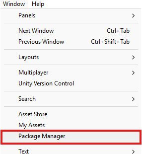
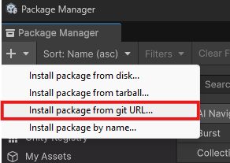

# Toolkit Unity Package
## Description
This is my personal "code unity luggage" where I keep all kinds of utility scripts and reusable UI components and animations.  
I often stumbled upon repeating scenarios where I needed a script for a specific mechanic but which is also often required when developing a game (a character controller, a menu system etc.).
Facing this "issue" of copying scripts from other projects (which is not really an issue but maybe a **threat** to the [DRY principle](https://en.wikipedia.org/wiki/Don%27t_repeat_yourself) at a larger scale), I decided to learn how to make a Unity package!

## Installation
> **1. Access the Unity Package Manager in Unity by clicking on `Window` > `Package Manager`.** 

> **2. Click on the `+` button and select `Add package from git URL...`.**

> **3. Paste the following URL in the input field: `https://github.com/AdriKat2022/UtilsUnityPackage.git`**

_You can choose a specific version by appending "#v1.5.0" to the above URL if you would like to install the version v1.5.0 for example._

> **4. Click on `Install`**

> **5. Profit!**

## About the code
Part of the goal of this package is to provide scripts that are easy to use and understand. But also to get better at writing code that is clean, efficient, maintainable, and documented.

### Rules I follow for this development
Here are the rules I believe are great to follow when writing code that I abide to for this package:
- **Coherent naming convention**: Private fields are prefixed with an underscore, public properties and methods are PascalCase, and other fields and local variables are camelCase.
- **Consistent code style**: The code's indentation and braces placement is kept consistent.
- **Well-placed comments**: Comments are used to explain the code's purpose, and to provide additional information when necessary. The code is kept to be as self-explanatory as possible.
- **Code documentation**: Public methods and properties are always documented (if not, it means I forgot, you have the permission to yell at me if you find one).
- **Encapsulation**: Fields are kept private unless useful for the average user of the code. Direct references are avoided in general contexts, therefore, I tend more to use events and delegates actions for callbacks.
- **Efficiency**: I attempt to write code that is efficient and optimized. I avoid unnecessary operations and try to keep the code as clean as possible.
- **Unity API usage**: I try to use the Unity API in the most efficient way possible. I avoid using `Update()` when it's not necessary, and I use `OnEnable()` and `OnDisable()` when needed.
- **DRY principle**: I use inheritance, interfaces and composition accordingly on top of other OOP principles to keep the code maintainable and reusable.
- **No magic numbers**: Using magic numbers in the code is close to banned. I use constants or serialized fields instead to keep the code extra flexible from the inspector.

## Content
I intend to make this package grow in power and make it as much handy as possible.  
With care and patience, it could even be useful for production.  

For the moment, here are the current contents of this package.

### [***NEW***] Audio ecosystem
*Always had to repeat the same process again and again with Audio/Sound/NoiseManager?*  
***Stop repeating !*** *The Toolkit AudioManager ecosystem will make you save valuable time.*  
- `AudioManager` **class**: Generalised audio singleton. Has got the classic Play/Pause/Stop methods. You can have as many audio channels as you want, and you can override the used audio channel while using those methods.

*Guess what, you have a new audio file to integrate among 35 other fields or in a 35-elements-long array in the audio manager. Adding another field again? That's the old school method.*
- `AudioIDs` **class** [AUTO-GENERATED]: Yes, it is AUTO-matically generated. Click and drag your audio clips to the inspector from your project tab to build your sound database. From it, this class will fill of `CONST string`s referencing *every single audio clip in the database*, ensuring **TYPE-SAFETY**! No more `AudioManager.Instance.Play(AudioManager.Instance.IWantThisSongSpecifically);`s.

What's also really cool, is that audio settings concerning this ecosystem can be modified via a **scriptable object**, automatically created at `Assets/Settings/AudioSettings.asset`.

### ***[NEW]*** Settings Provider
*Settings providers can simplify and facilitate Data Driven Development (it's not really about DDD because it's more of an editor tool, but that sounded cool) by reducing needed code, because everything already works practically the same.*  
*For example, in the previous Audio ecosystem section, I shortly presented audio settings that can be modified by you so the system suits your needs. This ecosystem uses the SettingsProvider*  

*Well if you would like to also have your own settings, that would be literally one line away. Make your `ThingSettingsSO` scriptable object with all your beloved settings (strings, ints, floats, anything you want). Then the literal and mythical single line:*

- `public class ThingSettingsProvider : SettingsProvider<ThingSettingsSO> {}`

Yes that's all.  
*Now the second you want to access it, just use `ThingSettingsProvider.GetOrCreateSettings().YourSuperStringSetting`.*

### Debugging
- **LiveLogger class**: Allows easy log display inspired by the UnrealEngine logging system. Offers a new log feedback layer by unclogging the Unity console for specific logs, or straight up if the Unity console is unavailable.

### [***NEW***] Attributes for the Unity Editor
- `[ButtonAction]` — Prints one or multiple buttons above or below a field. The fired function(s) do not have to be static and can be given custom names. Must be used on a field.
- `[DisplayClass]` — Enables in-place editing of a class, like a struct. Must be used on a field of a reference type.
- `[Enum]` — Replaces the default field drawer by a multi-select like an enum. If used on an int or float, you must provide the available options yourself. Must be used on a field of type enum, float, or int.
- `[ReadOnly]` — Disables editing from the inspector, making the field effectively read-only. Must be used on a field.
- `[Required]` — Display a warning in the inspector if this field is missing (empty or null). Must be used on a field.
- `[ShowIf]` — Conditionally shows or hides a field in the inspector. The condition can be a bool field or a function returning a bool.
- `[WarnIf]` — Conditionally shows a warning above a field in the inspector. The condition can be a bool field or a function returning a bool.

_What do you mean it's inspired from "Oclin"? "Idin"? Nope, absolutely no clue what you're talking about._

### Code Patterns
- `Singleton` **class**: A simple Singleton pattern implementation.
- `SingletonThreadSafe` **class**: A simple Singleton pattern with a safer implementation for threads.

### Animations
#### Text Animations
*Various ready-to-use text animations.*  
*These scripts have a pretty much highly tweakable with many options serialized in the editor.*  
- `RainbowTextMeshProGUI` **class**: Highly tweakable rainbow effect for UI text.  
- `RainbowTextMeshPro` **class**: Highly tweakable rainbow effect for 3D text.  

#### Scripted Animations (UI & 3D)
*Various ready-to-use animations for UI components (anything that has a RectTransform) or for 3D objects.*  
- `ButtonAnimation` **class**: Script providing animations like scaling and rotating upon different button events. 
- `CameraShake` **class**: Smart shaking effect that can be used on any Transform. A good example would involve the camera. Provides many options to tweak the shake effect.

### UI Elements
- [***NEW***] `DraggableWindow` **class**: Handles an object that can be dragged by the player anywhere on the screen. It can also be resized by using a knob using the `ResizableArea` script.  
- `SlideSelector` **class**: Small selector system allowing a user to select something among various options. Includes previous/next buttons, swiping, object click and submitting. **Does NOT require a RectTransform (Transforms work fine).**
- `HoldAction` **class**: Script that allows to trigger an action when holding a button for a certain amount of time. Provides many options to tweak the holding visual effect.
- `SimpleTimer` **class**: Simple timer that can be used to display a count-up (and a countdown comming soon). Format is automated.

### Utility and Others
- [***NEW***] `RectTransformUtility` **class**: Various useful RectTransform utilities.
- `Vector2N`/`Vector3N` **class**: Vector2/Vector3 wrapper with an additional flag named "Use Normalised". The editor shows it nicely in the inspector while you only need to use `Get()` in the code, regardless of the flag. The wrapper takes care of it.
- `Mathematics` **class**: Various math utilities.